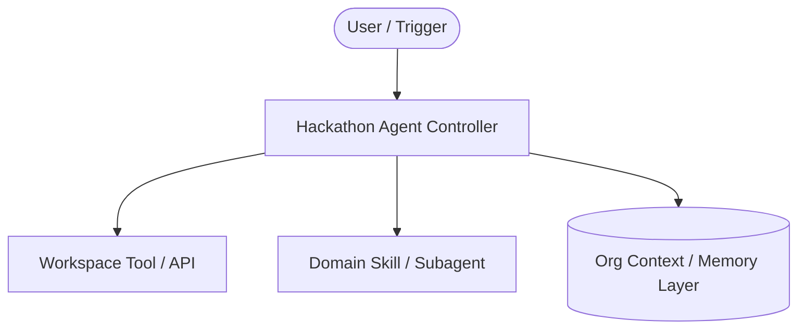

# AI2 Agents at Work Hackathon 2026 - Project Design Document

## 📌 Project Overview

-   **Project Title:** DONNA: Desk Occupancy Notification & Navigation Assistant
-   **Team Members:** Wilson Zheng (@wilsonzheng), jeofo (@jeofo)
-   **Theme:** [Productivity & Inbox Management | Developer Velocity | Meeting &
    Collaboration | Blue Sky]
-   **Target CUJ (Critical User Journey):**
    *   *As a [User Persona], I want to [Perform Action] so that I can [Achieve
        Impact/Save Time].*

--------------------------------------------------------------------------------

## 🎯 Rubric Alignment Strategy

### 1. Business Impact & Work Transformation (35%)

-   **Problem Statement:** Describe the exact workflow bottleneck or manual
    friction point today.
-   **Estimated Quantified Impact:** Hours saved per week / reduction in MTTR /
    engineering velocity gain.

### 2. Human-Agent Experience (HAX) (25%)

-   **Interaction Model:** Describe how the user interacts with the agent (CLI,
    Web UI, ambient sidecar, or automated triggers).
-   **Trust & Provenance:** How does the agent explain its reasoning and provide
    auditable sources/citations?

### 3. Agentic Innovation & Sophistication (20%)

-   **Multi-Agent / Architecture Pattern:**
    *   Define specialized subagents or skills used.
    *   Diagram of control flow and tool execution.

### 4. Technical Execution & Robustness (20%)

-   **Components:**
    *   Frontend / UI / CLI
    *   Backend / Tool Integrations (Drive, Sheets, Gmail, Moma)
    *   Evaluation Harness & Testing

--------------------------------------------------------------------------------

## 🏗️ System Architecture

--------------------------------------------------------------------------------

## 📋 Milestones & Deliverables

1.  [ ] **Milestone 1:** Core prototype execution & happy path demo.
2.  [ ] **Milestone 2:** Error handling, guardrails & HAX refinement.
3.  [ ] **Milestone 3:** 3-Minute Demo Video recording & final submission to
    repository.
